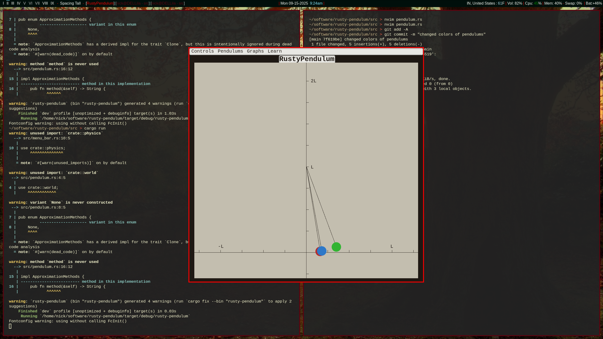

# RustyPendulum

## TL;DR: A Pendulum Simulator

This project is a simple simulation of a simple pendulum. The goal is to demonstrate how different solutions to the simple pendulum (small angle analytical approximation vs Euler, Euler-Cromer, Runge-Kutta numerical approximations) compare. 

This project is the successor of [PendulumSIM](#what-is-pendulumsim): https://github.com/NickAllbritton/pendulum-sim

## Progress

The project is being written in Rust and the chosen GUI platform is [FLTK](https://fltk-rs.github.io/fltk-book/Home.html). 
There is now functionality! Although it still needs work, Small-angle approximation, Euler method and Euler-Cromer method are all implemented.
There is no way to set where the pendulum starts right now except by changing the code, so that will need to be changed. 

Future plans:
- Show a 'shadow' pendulum which holds the place of the start position with ApproximationMethods::None
- Controls->Reset menu bar option resets all the pendulum angles/velocities to the shadow pendulum
- Allow dragging the pendulums from 0 degrees to starting position with mouse
- Track relevant physical quantities against a global time variable to allow graphs to be opened from the menu and/orcsv files to be opened after to create graphs with a spreadsheet

## What is PendulumSIM

[PendulumSIM](https://github.com/NickAllbritton/pendulum-sim) is a programming project created by me, Nick, in 2023. It was begun as a student project for the Indiana State University chapter of the Society of Physics Students (SPS). 

## Why rewrite? Why not write something new?

Ummm, first of all, why so judgmental? Anyhow, there is good reason to port to Rust in this case.

- Problem: The original project bottle-necked due to a steep learning curve. I severely over-estimated the free-time and motivation my fellow undergraduate students would have to learn the physics concepts, programming language, and project structure in addition to their heavy university workload. The original project was a cmake project compiling C++ code for SFML graphics. I ended up being the only person contributing to the project. Therefore, I struggled to write clean C++ code and complete the project since I had my own classes. The previous project was so buggy that simply rebuilding and running on another system caused seg faults. A better project design was needed to solve this task.

- Considerations: Python is a language that is very popular in university classrooms for some reason. Most students have seen some Python before, though, so that would make it an ideal choice to fix some of these problems. However, python would be slower than C++ to run, and great libraries for graphics seem difficult to track down. 

- Solution: Rust greatly simplifies the build process of older systems level languages like C++ and C by shipping with its own build system: Cargo. To contribute to the project, simply install Rust and clone the project. Rust makes seg faults and other such issues that were plaguing [PendulumSIM](https://github.com/NickAllbritton/pendulum-sim) easily preventable, however, Rust is also a very fast language. So, Rust was my ideal candidate to port the simulation.
